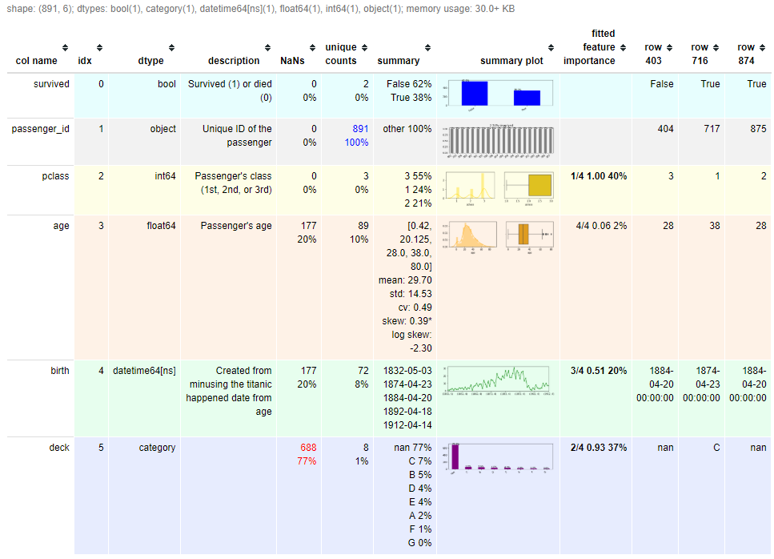

Tll549 (Ethan)'s Exploratory Functions

[Email](mailto:el@tll.tl)

In summary, it generates a metadata dataframe (like above) that summarize everything using one line `TEF.dfmeta`. It also include a few one line function that you can 

- `auto_set_dtypes`
- `plot_1var`: plot univariate plots for every columns
- `fit`: fit default machine learning models by doing everything with default setting

With these, you can generate a metadata dataframe in another file as a data dictionary, with variable descriptions, feature importance of your trained model and a quick summary plot. See quick start in my blog for more detail.

Please read:

[Quick start with the titanic dataset](http://tll.tl/geek/2019/tef-quick-start-with-titanic/)

[Documentation](http://tll.tl/tef/tef-documentations/)

[Release Notes](http://tll.tl/tef/tef-release-note/)

- https://github.com/tll549/TEF
- https://pypi.org/project/TEF/